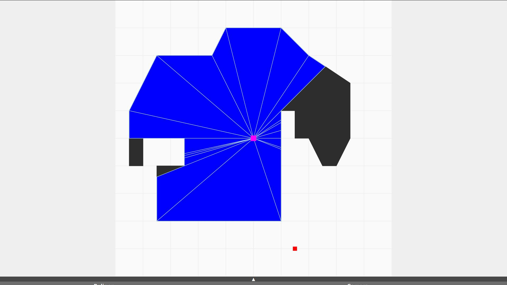

# Visibility
Visibility polygon generator for Computational Geometry course.
Mostly worked on the UI.

## Screenshots
<table>
  <tr>
    <td></td>
    <td></td>
  </tr>
  <tr>
    <td></td>
    <td></td>
  </tr>
</table>
